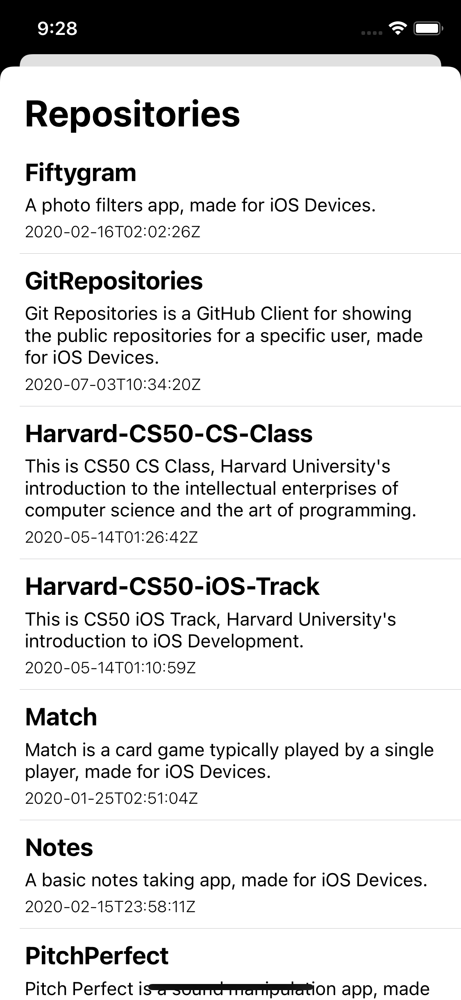

# Git Repositories
Git Repositories is a GitHub Client for showing the public repositories for a specific user, made for iOS Devices.

 | |
---------------------------|---------------------------|-------------------------

## About
This project was a part of [SwiftyCamp](https://www.facebook.com/SwiftyCamp) iOS Bootcamp.
